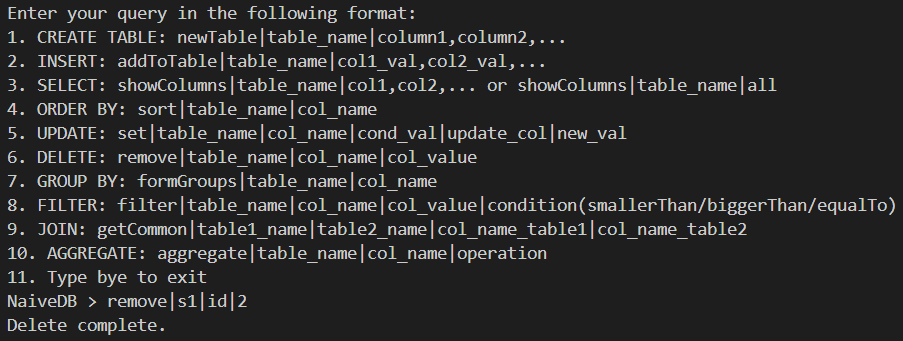

# NaiveDB - A Simple Database system

## Introduction

NaiveDB is a simple database system that implements its own query language, distinct from existing languages. The unique challenge is handling datasets in chunks, akin to real-world databases like MySQL, where only a portion of the data is loaded into memory at a time.

## Planned Implementation

NaiveDB assumes a dataset limited to loading 500 rows in memory at a time. It showcases basic CRUD operations, projection, filtering, join, grouping, aggregation, and ordering. The implementation focuses on a user-friendly console interface, processing queries step by step.

## Architecture Design

NaiveDB interacts with users via a console interface. The program prompts the user for queries, parses them, executes the corresponding functions, and outputs the results to the console. The flow involves user input, parsing, function execution, and console output.

## Functionalities and Tech Stack

### Functionalities

1. **CREATE TABLE:** `newTable|table_name|column1,column2,...`
2. **INSERT:** `addToTable|table_name|col1_val,col2_val,...`
3. **SELECT:** `showColumns|table_name|col1,col2,...` or `showColumns|table_name|all`
4. **ORDER BY:** `sort|table_name|col_name`
5. **UPDATE:** `set|table_name|col_name|cond_val|update_col|new_val`
6. **DELETE:** `remove|table_name|col_name|col_value`
7. **GROUP BY:** `formGroups|table_name|col_name`
8. **FILTER:** `filter|table_name|col_name|col_value|condition(smallerThan/biggerThan/equalTo)`
9. **JOIN:** `getCommon|table1_name|table2_name|col_name_table1|col_name_table2`
10. **AGGREGATE:** `aggregate|table_name|col_name|operation`

### Tech Stack

- **Python:** Core programming language for implementing database operations.
- **CSV:** File format for storing table data.
- **Git:** Version control for tracking code changes.
- **Visual Studio Code (or any Python IDE):** Development environment.

## Implementation Screenshots

## Learning Outcomes and Challenges Faced

Building NaiveDB presented various challenges, such as implementing sorting, joining, and efficient memory management. External merge sort addressed sorting challenges, and nested loop join was applied for joining tables. The use of chunk processing optimized memory usage. Challenges also included efficient handling of duplicate IDs during insertion.

## Conclusion

NaiveDB serves as an educational tool, offering foundational insights into database management. Its simplicity aids learners in grasping essential concepts. Future enhancements aim to improve usability, support complex queries, and introduce a web-based frontend for user interaction.

## Future Scope

- Support multiline queries.
- Extend join functionality to multiple types and tables.
- Allow users to choose primary key column names.
- Develop a frontend web application for query processing.
- Enhance output presentation for better user experience.
- Expand aggregation and sorting capabilities.
